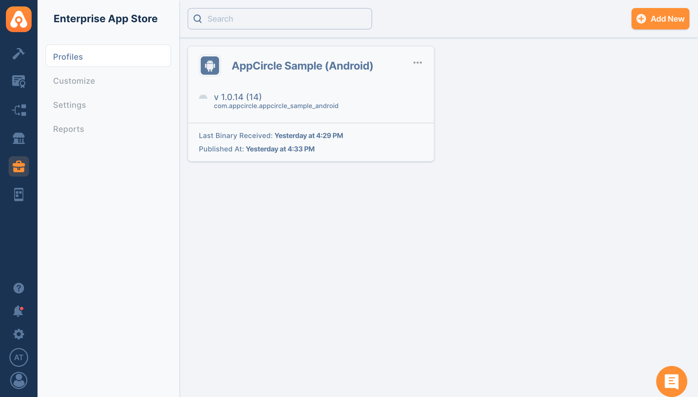
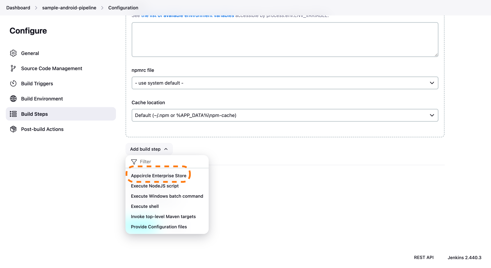

## Appcircle Enterprise App Store

Appcircle Enterprise Mobile App Store is your own mobile app store for providing access to in-house apps with a customizable mobile storefront.

- **Customizable Storefront:** Distribute your in-house apps with a fully customizable mobile storefront.
- **Secure Distribution:** Everything you need for secure, streamlined distribution of your in-house apps.
- **No MDM Required:** Allows distribution of B2B and B2E applications without the need for an MDM solution and enrollment.

Learn more about [Appcircle Enterprise App Store](https://appcircle.io/enterprise-app-store?&utm_source=azure&utm_medium=product&utm_campaign=enterprise_app_store).

## What Sets Apart Appcircle Enterprise Mobile App Store

1. **Direct File Sharing:**
   - **Skip Traditional Stores:** Share .IPA, APK, or AAB files directly, avoiding the need to wait for Apple App Store or Google Play approvals.
2. **Flexible Sharing Options:**
   - **Beta and Live Modes:** Share your app in ‘beta’ mode for testing new features or identifying bugs, or in ‘live’ mode for stable versions. This flexibility helps maintain the development lifecycle without interruptions.
3. **Enhanced Security:**
   - **Secure Authentication:** Access the Enterprise Mobile App Store with extra secure authentication using Enterprise Authentication Methods.
   - **Controlled Access:** Ensure that only authorized users can access the app store and its contents.
4. **Customizable Mobile Storefront:**
   - **Tailored Experience:** Provide a customizable mobile storefront for your in-house apps, ensuring a tailored experience that aligns with your brand and user needs.
5. **No MDM Requirement:**
   - **Simplified Distribution:** Distribute B2B and B2E applications without the need for a Mobile Device Management (MDM) solution or enrollment, reducing complexity and costs.
6. **Streamlined Workflow:**
   - **Seamless Integration:** Integrates smoothly with your existing workflow, making it easy to manage and distribute apps within your organization.
   - **Efficient Management:** Track and manage applications, versions, testers, and teams effectively, ensuring a smooth distribution process.

These features make the Appcircle Enterprise Mobile App Store a powerful tool for securely and efficiently distributing in-house applications, offering flexibility, enhanced security, and a streamlined workflow.

### Enterprise App Store

After uploading your build successfully, you will see your app in the "Enterprise App Store" module like below

### Install Appcircle Enterprise Store Plugin

Go to your Jenkins dashboard and follow, Manage Jenkins > Plugins and search for "Appcircle Enterprise Store"

### Add Plugin in Build Steps

Go to your configuration page of the project add a build step.

### Configure Plugin

After adding the plugin into your build steps make sure you fulfill required inputs.
Also, do not forget to add the plugin after your build steps. Because you will be asked to provide the build path.

### Generating/Managing the Personal API Tokens

To generate a Personal API Token, follow these steps:

1. Go to the My Organization screen (the second option at the bottom left).
2. You'll find the Personal API Token section in the top right corner.
3. Press the "Generate Token" button to generate your first token.

### Leveraging Environment Variables

Utilize environment variables seamlessly by substituting the parameters with `$(VARIABLE_NAME)` in your task inputs. The extension automatically retrieves values from the specified environment variables within your pipeline.

Efficiently distribute test binaries or beta versions using Appcircle, featuring seamless IPA and APK distribution capabilities. Streamline your testing process with our versatile tool designed to optimize your distribution workflow. If you need support or more information, please [contact us](https://appcircle.io/contact)

### Reference

- For details on generating an Appcircle Personal Access Token, visit [Generating/Managing Personal API Tokens](https://docs.appcircle.io/appcircle-api/api-authentication#generatingmanaging-the-personal-api-tokens)

- To create or learn more about Appcircle testing and distribution profiles, please refer to [Creating or Selecting a Distribution Profile](https://docs.appcircle.io/distribute/create-or-select-a-distribution-profile)

## Issues

Report issues and enhancements at info@appcircle.io

## LICENSE

Licensed under MIT, see [LICENSE](LICENSE.md)
